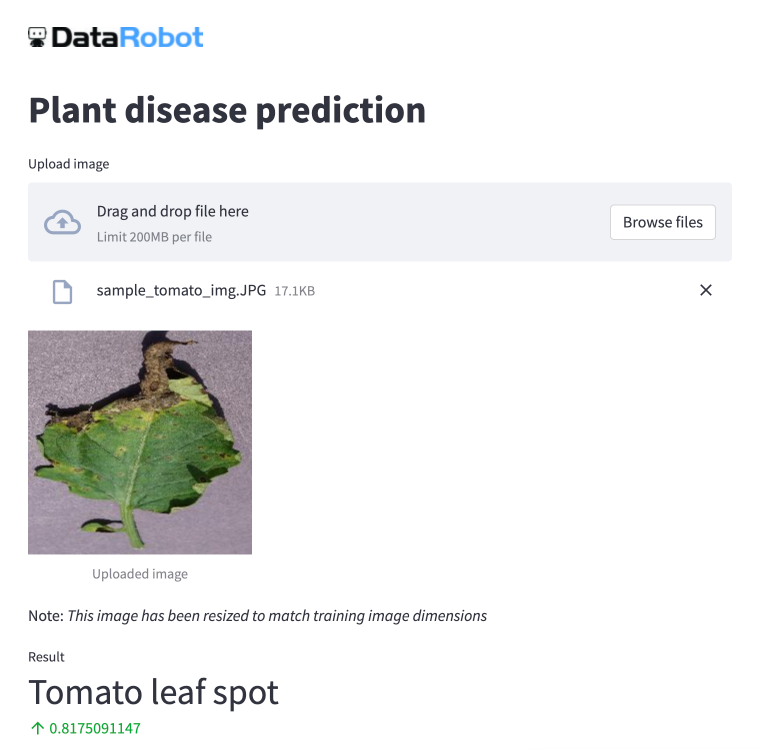

[Application Link]() #todo Deploy

Steffen Rocker's app to be able to drag and drop and score images in native format without the user having to configure them into base64. 
This was used in a POV where users were not python programmers.  

